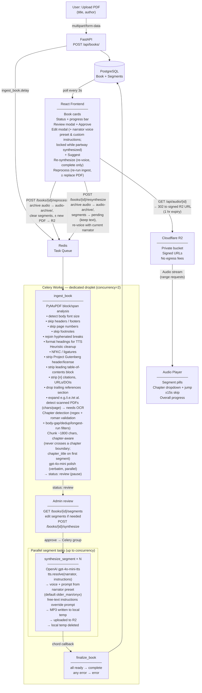

# AudioBookLib Pipeline



## Status flow

```
Book:    pending → processing → review → synthesizing → complete
                                      (admin approves)  ↘ error

Segment: pending → processing → ready
                              ↘ error
```

## Observability (admin panel)

The pipeline records notable occurrences to a `pipeline_events` table
(errors + warnings), written from both the web and worker droplets — they
share Postgres, so worker-side failures surface without the web tier reaching
the worker directly:

- `ingest_book` — records a **warning** when a PDF looks scanned (needs OCR) or
  when chunks fall back to heuristic text (LLM polish unavailable), and an
  **error** (with traceback) if extraction fails.
- `synthesize_segment` — records an **error** (with traceback) per failed segment.
- A Celery `task_failure` signal catches anything unhandled as a backstop.

Admins read these at `GET /api/admin/events` and in the admin panel's
"Pipeline events" list. Book status counts, the books table, and events all
back the `#/admin` view.

Live infrastructure state rides the shared Redis broker (the worker droplet
has no public IP, so nothing reaches it over HTTP):

- `GET /api/admin/workers` — queue depth (`LLEN` on the default queue) plus
  per-worker concurrency/uptime/running tasks via parallel Celery `inspect`
  broadcasts, which the worker answers over the broker.
- `GET /api/admin/resources` — memory/swap/load with ok/warn/critical severity
  (thresholds tied to the OOM history). The web droplet is read live via
  psutil; the worker self-reports on a `worker_ready` daemon thread that
  refreshes a 120s-TTL Redis key every 30s — a dead worker shows as a stale
  key, and any critical host raises a banner atop the panel.
- `GET /api/admin/logs?source=web|worker` — web tails a rotating file on the
  storage volume; the worker ships each log line into a capped Redis list
  (1000) from Celery's logger-setup signals.

## Services

| Service         | Role                                              |
|-----------------|---------------------------------------------------|
| FastAPI         | REST API, file storage                            |
| Celery          | Background task execution                         |
| Redis           | Broker + result backend                           |
| PostgreSQL      | Persistent metadata (Alembic migrations)          |
| Cloudflare R2   | MP3 storage (private bucket, signed URLs)         |
| OpenAI gpt-4o-mini-tts | Audio synthesis (per-book narrator voice preset + optional custom instructions) |
| OpenAI gpt-4o-mini | Metadata suggestions + text cleanup polish     |
| Google OAuth (Authlib) | Sign-in; admin role gates uploads/edits/synthesis |

## Hosting

| Component  | Provider        | Notes                              |
|------------|-----------------|------------------------------------|
| Web droplet | DigitalOcean (sfo2) | FastAPI + Postgres + Redis + nginx (port 80); public bastion |
| Worker droplet | DigitalOcean (sfo2) | Celery worker only; no public IP, egress NAT'd via web droplet; reaches Postgres/Redis over the VPC (10.120.0.2) |
| Storage    | Cloudflare R2   | PDFs + MP3s                        |
| CDN / SSL  | Cloudflare      | DNS proxy, free SSL                |

## Fallback (local dev)

If `R2_ACCOUNT_ID` is not set, audio and PDFs are stored on the local
filesystem, with range-request streaming for audio. If `DATABASE_URL` is
not set, SQLite is used instead of PostgreSQL. No code changes needed to
switch modes.
