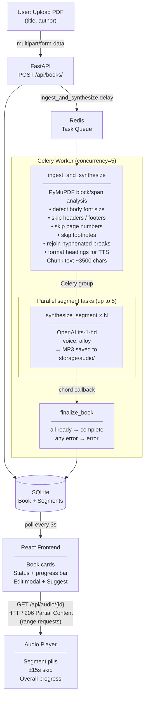

# AudioBookLib Pipeline



## Status flow

```
Book:    pending → processing → synthesizing → complete
                                             ↘ error

Segment: pending → processing → ready
                              ↘ error
```

## Services

| Service  | Role                        |
|----------|-----------------------------|
| FastAPI  | REST API, file storage      |
| Celery   | Background task execution   |
| Redis    | Broker + result backend     |
| SQLite   | Persistent state            |
| OpenAI   | TTS (`tts-1-hd`) + metadata suggestions (`gpt-4o-mini`) |
