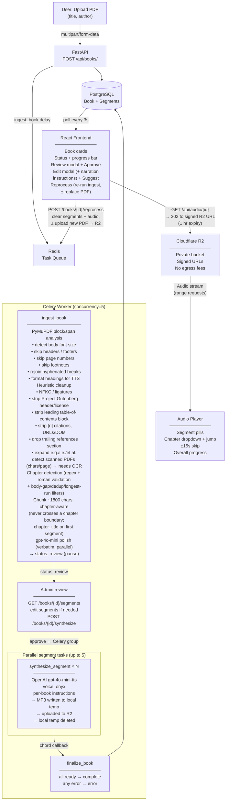

# AudioBookLib Pipeline



## Status flow

```
Book:    pending → processing → review → synthesizing → complete
                                      (admin approves)  ↘ error

Segment: pending → processing → ready
                              ↘ error
```

## Services

| Service         | Role                                              |
|-----------------|---------------------------------------------------|
| FastAPI         | REST API, file storage                            |
| Celery          | Background task execution                         |
| Redis           | Broker + result backend                           |
| PostgreSQL      | Persistent metadata (Alembic migrations)          |
| Cloudflare R2   | MP3 storage (private bucket, signed URLs)         |
| OpenAI gpt-4o-mini-tts | Audio synthesis (per-book narration instructions) |
| OpenAI gpt-4o-mini | Metadata suggestions + text cleanup polish     |
| Google OAuth (Authlib) | Sign-in; admin role gates uploads/edits/synthesis |

## Hosting

| Component  | Provider        | Notes                              |
|------------|-----------------|------------------------------------|
| App server | DigitalOcean droplet | FastAPI + Celery + Redis + nginx (port 80) |
| Storage    | Cloudflare R2   | PDFs + MP3s                        |
| CDN / SSL  | Cloudflare      | DNS proxy, free SSL                |

## Fallback (local dev)

If `R2_ACCOUNT_ID` is not set, audio and PDFs are stored on the local
filesystem, with range-request streaming for audio. If `DATABASE_URL` is
not set, SQLite is used instead of PostgreSQL. No code changes needed to
switch modes.
