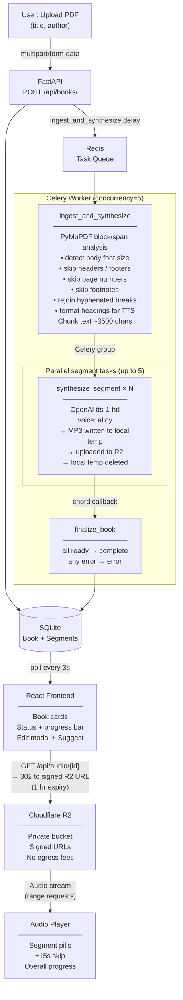

# AudioBookLib Pipeline



## Status flow

```
Book:    pending → processing → synthesizing → complete
                                             ↘ error

Segment: pending → processing → ready
                              ↘ error
```

## Services

| Service         | Role                                              |
|-----------------|---------------------------------------------------|
| FastAPI         | REST API, file storage                            |
| Celery          | Background task execution                         |
| Redis           | Broker + result backend                           |
| SQLite          | Persistent metadata                               |
| Cloudflare R2   | MP3 storage (private bucket, signed URLs)         |
| OpenAI tts-1-hd | Audio synthesis                                   |
| OpenAI gpt-4o-mini | Metadata suggestions                           |

## Hosting

| Component  | Provider        | Notes                              |
|------------|-----------------|------------------------------------|
| App server | DigitalOcean droplet | FastAPI + Celery + Redis + nginx (port 80) |
| Storage    | Cloudflare R2   | PDFs (local) + MP3s (R2)           |
| CDN / SSL  | Cloudflare      | DNS proxy, free SSL                |

## Fallback (local dev)

If `R2_ACCOUNT_ID` is not set, audio is served from the local filesystem
with range-request streaming. No code changes needed to switch modes.
